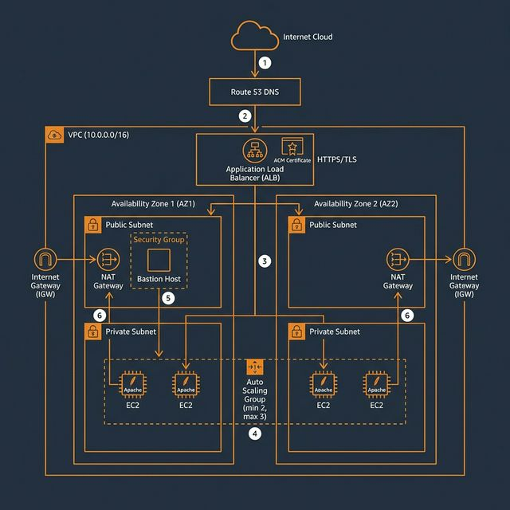
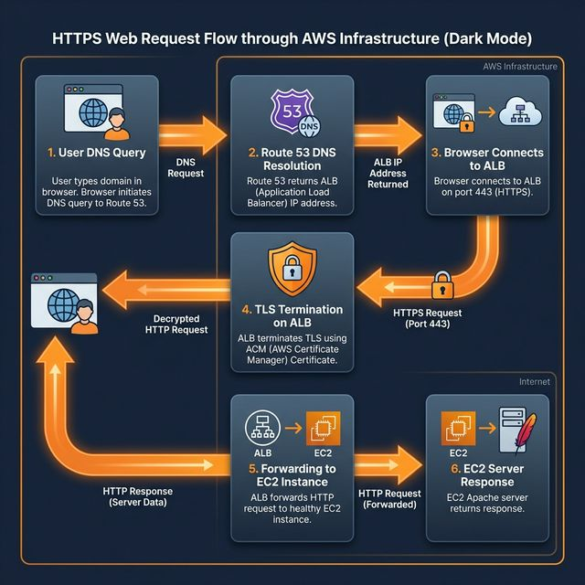
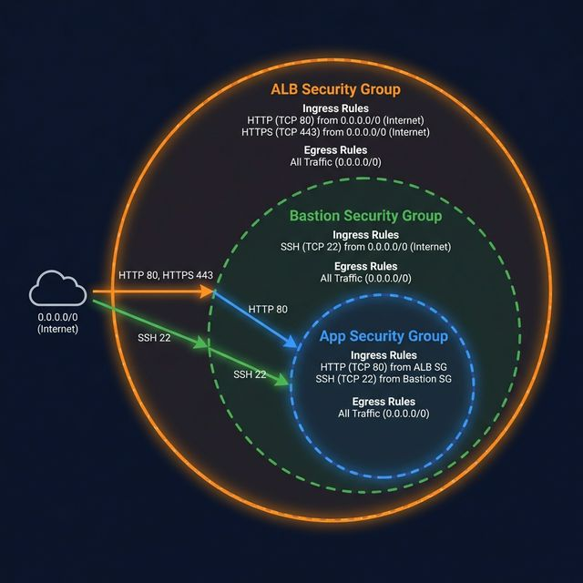
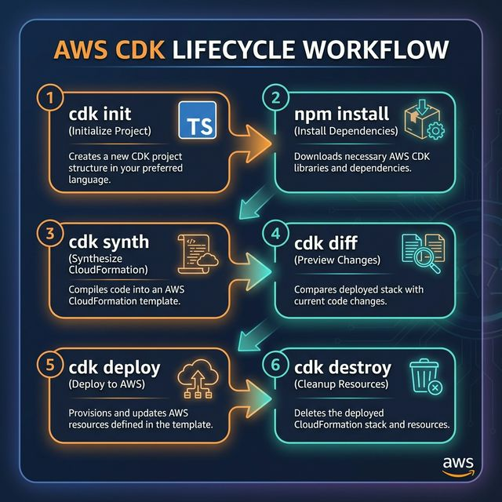
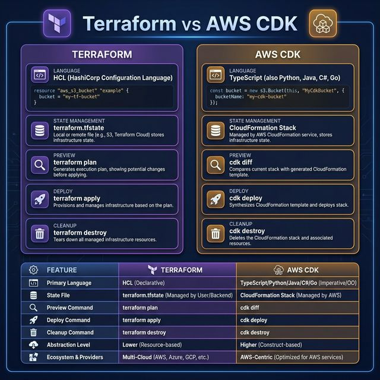

# 🏗️ AWS CDK — Load Balancer Infrastructure

> Replicates the Terraform load-balancer infrastructure using **AWS CDK (TypeScript)**.
> Provisions a production-ready, highly available web application on AWS with ALB, Auto Scaling, HTTPS termination, and Route 53 DNS.

---

## 📑 Table of Contents

1. [Architecture Overview](#-architecture-overview)
2. [Traffic Flow](#-traffic-flow)
3. [Security Groups](#-security-groups)
4. [Resource Mapping — Terraform vs CDK](#-resource-mapping--terraform-vs-cdk)
5. [Prerequisites](#-prerequisites)
6. [Configuration](#-configuration)
7. [CDK Lifecycle Commands](#-cdk-lifecycle-commands)
8. [Step-by-Step Deployment](#-step-by-step-deployment)
9. [Outputs](#-outputs)
10. [Project Structure](#-project-structure)
11. [Terraform vs CDK Comparison](#-terraform-vs-cdk-comparison)
12. [Troubleshooting](#-troubleshooting)
13. [Cleanup](#-cleanup)

---

## 🌟 Architecture Overview

The CDK stack provisions a complete AWS infrastructure for hosting a load-balanced web application across two Availability Zones with automatic scaling and HTTPS support.



### Architecture Components

| Component              | Purpose                 | Specification                |
| :--------------------- | :---------------------- | :--------------------------- |
| **VPC**                | Isolated network        | `10.0.0.0/16`                |
| **Public Subnets**     | ALB + Bastion access    | `10.0.1.0/24`, `10.0.2.0/24` |
| **Private Subnets**    | App servers (isolated)  | `10.0.3.0/24`, `10.0.4.0/24` |
| **Internet Gateway**   | Public internet access  | Attached to VPC              |
| **NAT Gateway**        | Private subnet outbound | In Public Subnet 1           |
| **ALB**                | Load distribution + TLS | Internet-facing, 2 AZs       |
| **Auto Scaling Group** | Capacity management     | Min: 2, Max: 3 instances     |
| **Bastion Host**       | SSH jump box            | Public Subnet 1              |
| **Route 53**           | DNS management          | `garden.srinivaskona.life`   |
| **ACM Certificate**    | HTTPS/TLS termination   | ALB listener                 |

---

## 🔄 Traffic Flow

This diagram shows how a user's HTTPS request flows through the AWS infrastructure, from DNS resolution to the response.



### Step-by-Step Request Flow

| Step  | Action               | Details                                                   |
| :---: | :------------------- | :-------------------------------------------------------- |
| **1** | **DNS Query**        | Browser queries Route 53 for `garden.srinivaskona.life`   |
| **2** | **DNS Resolution**   | Route 53 returns the ALB's IP address (A Alias record)    |
| **3** | **HTTPS Connection** | Browser connects to ALB on port `443` (HTTPS)             |
| **4** | **TLS Termination**  | ALB terminates TLS using ACM Certificate                  |
| **5** | **HTTP Forward**     | ALB forwards request to healthy EC2 instance on port `80` |
| **6** | **Response**         | Apache on EC2 returns the HTML response                   |

---

## 🔒 Security Groups

Three layers of security groups control network access throughout the infrastructure.



### Security Rules Summary

#### ALB Security Group

| Direction | Port  | Source      | Description          |
| :-------- | :---: | :---------- | :------------------- |
| Ingress   | `80`  | `0.0.0.0/0` | HTTP from anywhere   |
| Ingress   | `443` | `0.0.0.0/0` | HTTPS from anywhere  |
| Egress    |  All  | `0.0.0.0/0` | All outbound traffic |

#### Bastion Security Group

| Direction | Port | Source      | Description          |
| :-------- | :--: | :---------- | :------------------- |
| Ingress   | `22` | `0.0.0.0/0` | SSH from anywhere    |
| Egress    | All  | `0.0.0.0/0` | All outbound traffic |

#### App Security Group

| Direction | Port | Source      | Description           |
| :-------- | :--: | :---------- | :-------------------- |
| Ingress   | `80` | ALB SG      | HTTP from ALB only    |
| Ingress   | `22` | Bastion SG  | SSH from Bastion only |
| Egress    | All  | `0.0.0.0/0` | All outbound traffic  |

---

## 🔄 Resource Mapping — Terraform vs CDK

All 32 CloudFormation resources generated by CDK, mapped to their Terraform equivalents:

|  #  | AWS Resource              | Type                                        | Terraform File | CDK Section   |
| :-: | :------------------------ | :------------------------------------------ | :------------- | :------------ |
|  1  | VPC                       | `AWS::EC2::VPC`                             | `vpc.tf`       | NETWORKING    |
|  2  | Internet Gateway          | `AWS::EC2::InternetGateway`                 | `vpc.tf`       | NETWORKING    |
|  3  | IGW Attachment            | `AWS::EC2::VPCGatewayAttachment`            | `vpc.tf`       | NETWORKING    |
|  4  | Public Subnet 1           | `AWS::EC2::Subnet`                          | `subnets.tf`   | NETWORKING    |
|  5  | Public Subnet 2           | `AWS::EC2::Subnet`                          | `subnets.tf`   | NETWORKING    |
|  6  | Private Subnet 1          | `AWS::EC2::Subnet`                          | `subnets.tf`   | NETWORKING    |
|  7  | Private Subnet 2          | `AWS::EC2::Subnet`                          | `subnets.tf`   | NETWORKING    |
|  8  | Elastic IP (NAT)          | `AWS::EC2::EIP`                             | `vpc.tf`       | NETWORKING    |
|  9  | NAT Gateway               | `AWS::EC2::NatGateway`                      | `vpc.tf`       | NETWORKING    |
| 10  | Public Route Table        | `AWS::EC2::RouteTable`                      | `subnets.tf`   | NETWORKING    |
| 11  | Public Route              | `AWS::EC2::Route`                           | `subnets.tf`   | NETWORKING    |
| 12  | Public RT Assoc 1         | `AWS::EC2::SubnetRouteTableAssociation`     | `subnets.tf`   | NETWORKING    |
| 13  | Public RT Assoc 2         | `AWS::EC2::SubnetRouteTableAssociation`     | `subnets.tf`   | NETWORKING    |
| 14  | Private Route Table       | `AWS::EC2::RouteTable`                      | `subnets.tf`   | NETWORKING    |
| 15  | Private Route             | `AWS::EC2::Route`                           | `subnets.tf`   | NETWORKING    |
| 16  | Private RT Assoc 1        | `AWS::EC2::SubnetRouteTableAssociation`     | `subnets.tf`   | NETWORKING    |
| 17  | Private RT Assoc 2        | `AWS::EC2::SubnetRouteTableAssociation`     | `subnets.tf`   | NETWORKING    |
| 18  | ALB Security Group        | `AWS::EC2::SecurityGroup`                   | `security.tf`  | SECURITY      |
| 19  | Bastion Security Group    | `AWS::EC2::SecurityGroup`                   | `security.tf`  | SECURITY      |
| 20  | App Security Group        | `AWS::EC2::SecurityGroup`                   | `security.tf`  | SECURITY      |
| 21  | Application Load Balancer | `AWS::ElasticLoadBalancingV2::LoadBalancer` | `alb.tf`       | LOAD BALANCER |
| 22  | Target Group              | `AWS::ElasticLoadBalancingV2::TargetGroup`  | `alb.tf`       | LOAD BALANCER |
| 23  | HTTP Listener             | `AWS::ElasticLoadBalancingV2::Listener`     | `alb.tf`       | LOAD BALANCER |
| 24  | HTTPS Listener            | `AWS::ElasticLoadBalancingV2::Listener`     | `alb.tf`       | LOAD BALANCER |
| 25  | Bastion Host              | `AWS::EC2::Instance`                        | `instances.tf` | COMPUTE       |
| 26  | Launch Template           | `AWS::EC2::LaunchTemplate`                  | `instances.tf` | COMPUTE       |
| 27  | Auto Scaling Group        | `AWS::AutoScaling::AutoScalingGroup`        | `instances.tf` | COMPUTE       |
| 28  | CPU Scaling Policy        | `AWS::AutoScaling::ScalingPolicy`           | `instances.tf` | SCALING       |
| 29  | Request Count Policy      | `AWS::AutoScaling::ScalingPolicy`           | `instances.tf` | SCALING       |
| 30  | Route 53 Hosted Zone      | `AWS::Route53::HostedZone`                  | `route53.tf`   | DNS           |
| 31  | Root Domain Record        | `AWS::Route53::RecordSet`                   | `route53.tf`   | DNS           |
| 32  | WWW Domain Record         | `AWS::Route53::RecordSet`                   | `route53.tf`   | DNS           |

---

## ✅ Prerequisites

Before deploying, ensure you have:

- **Node.js** ≥ 18.x (`node --version`)
- **AWS CLI** installed and configured (`aws --version`)
- **AWS CDK CLI**: `npm install -g aws-cdk`
- **AWS Credentials** exported:
  ```bash
  export AWS_ACCESS_KEY_ID="your-key"
  export AWS_SECRET_ACCESS_KEY="your-secret"
  export AWS_DEFAULT_REGION="ap-south-1"
  ```
- **SSH Key Pair** (`aws`) created in `ap-south-1` region
- **SSL Certificate** imported to ACM (see [Certificate Setup](#certificate-setup))

---

## ⚙️ Configuration

Configuration is managed via `cdk.json` context values:

| Variable      | Default                    | Description                                   |
| :------------ | :------------------------- | :-------------------------------------------- |
| `projectName` | `sri`                      | Prefix for all resource names                 |
| `domainName`  | `garden.srinivaskona.life` | Domain managed in Route 53                    |
| `certFolder`  | `garden`                   | Cert folder name under `load-balancer/certs/` |
| `keyName`     | `aws`                      | EC2 SSH key pair name                         |
| `awsRegion`   | `ap-south-1`               | AWS deployment region                         |
| `certArn`     | _(required)_               | ACM Certificate ARN for HTTPS                 |

### Override via CLI

```bash
npx cdk deploy -c projectName=myapp -c domainName=myapp.example.com -c certArn=arn:aws:acm:...
```

### Certificate Setup

> **Important**: CloudFormation does not support ACM certificate import natively.
> Import your certificate via AWS CLI first, then pass the ARN.

**Step 1 — Import your certificate to ACM:**

```bash
aws acm import-certificate \
  --certificate-body fileb://../load-balancer/certs/garden/body.pem \
  --private-key fileb://../load-balancer/certs/garden/tls.key \
  --certificate-chain fileb://../load-balancer/certs/garden/chain.pem \
  --region ap-south-1 \
  --query 'CertificateArn' --output text
```

**Step 2 — Use the returned ARN for deployment:**

```bash
npx cdk deploy -c certArn=arn:aws:acm:ap-south-1:ACCOUNT:certificate/ID
```

---

## 🔄 CDK Lifecycle Commands

The CDK lifecycle follows a structured workflow from initialization to cleanup.



### Command Reference

|  #  | Command         | Purpose                          | When to Use                   |
| :-: | :-------------- | :------------------------------- | :---------------------------- |
|  1  | `cdk init`      | Initialize new CDK project       | First time only               |
|  2  | `npm install`   | Install dependencies             | After init or adding packages |
|  3  | `npm run build` | Compile TypeScript               | Before synth/deploy           |
|  4  | `cdk synth`     | Generate CloudFormation template | Validate your code            |
|  5  | `cdk diff`      | Compare local vs deployed        | Before deploying changes      |
|  6  | `cdk deploy`    | Deploy to AWS                    | Create/update infrastructure  |
|  7  | `cdk destroy`   | Remove all resources             | Cleanup when done             |

### Detailed Command Descriptions

#### `cdk synth` — Synthesize

Converts your TypeScript CDK code into a CloudFormation JSON template. This is a **dry run** that doesn't touch AWS.

```bash
npx cdk synth                          # Generates YAML template
npx cdk synth --json                   # Generates JSON template
npx cdk synth --output cdk.out         # Writes to cdk.out/ directory
```

#### `cdk diff` — Preview Changes

Compares your local code against the currently deployed stack. Shows what will be added, modified, or removed.

```bash
npx cdk diff -c certArn=arn:aws:acm:...
```

#### `cdk deploy` — Deploy

Creates or updates the CloudFormation stack in AWS. This provisions all the actual resources.

```bash
npx cdk deploy -c certArn=arn:aws:acm:ap-south-1:ACCOUNT:certificate/ID
```

#### `cdk destroy` — Cleanup

Removes all resources created by the stack. This is irreversible.

```bash
npx cdk destroy
```

---

## 🚀 Step-by-Step Deployment

### Step 1: Install Dependencies

```bash
cd cdk/
npm install
```

### Step 2: Build (Compile TypeScript)

```bash
npm run build
```

### Step 3: Bootstrap CDK _(first time only)_

This creates the CDK toolkit stack with S3 bucket and IAM roles:

```bash
npx cdk bootstrap
```

### Step 4: Import Certificate to ACM

```bash
CERT_ARN=$(aws acm import-certificate \
  --certificate-body fileb://../load-balancer/certs/garden/body.pem \
  --private-key fileb://../load-balancer/certs/garden/tls.key \
  --certificate-chain fileb://../load-balancer/certs/garden/chain.pem \
  --region ap-south-1 \
  --query 'CertificateArn' --output text)

echo "Certificate ARN: $CERT_ARN"
```

### Step 5: Validate (Dry Run)

```bash
npx cdk synth -c certArn=$CERT_ARN    # Generate template
npx cdk diff -c certArn=$CERT_ARN     # Preview changes
```

### Step 6: Deploy

```bash
npx cdk deploy -c certArn=$CERT_ARN
```

### Step 7: Update GoDaddy Nameservers

After deployment, the output will display **Nameservers**. Update your domain registrar (GoDaddy) with these values:

```
Nameservers: ns-xxx.awsdns-xx.com, ns-xxx.awsdns-xx.org, ns-xxx.awsdns-xx.co.uk, ns-xxx.awsdns-xx.net
```

### Step 8: Verify

```bash
# Wait for DNS propagation (5-15 minutes), then:
curl -I https://garden.srinivaskona.life
dig garden.srinivaskona.life +short
```

---

## 📤 Outputs

After `cdk deploy`, you'll see these outputs (similar to `terraform output`):

| Output            | Description                                 | Example                                       |
| :---------------- | :------------------------------------------ | :-------------------------------------------- |
| `VpcId`           | ID of the created VPC                       | `vpc-0abc123def456`                           |
| `AlbDnsName`      | DNS name of the ALB                         | `sri-alb-123456.ap-south-1.elb.amazonaws.com` |
| `BastionPublicIp` | Public IP of the Bastion Host               | `13.233.x.x`                                  |
| `IgwId`           | ID of the Internet Gateway                  | `igw-0abc123def`                              |
| `NatGatewayId`    | ID of the NAT Gateway                       | `nat-0abc123def`                              |
| `Nameservers`     | Route 53 nameservers (➡️ update in GoDaddy) | `ns-xxx.awsdns-xx.com, ...`                   |

### Viewing Outputs After Deploy

```bash
# During deploy — outputs are printed automatically
npx cdk deploy -c certArn=...

# After deploy — query CloudFormation directly
aws cloudformation describe-stacks \
  --stack-name sri-load-balancer \
  --query 'Stacks[0].Outputs' \
  --output table
```

---

## 📂 Project Structure

```
cdk/
│
├── 📄 README.md                # This documentation
├── 📄 cdk.json                 # CDK configuration & context values
├── 📄 package.json             # Node.js dependencies
├── 📄 tsconfig.json            # TypeScript configuration
├── 📄 .gitignore               # Git ignore rules
│
├── 🔧 bin/
│   └── cdk.ts                  # CDK App entry point (configuration, stack wiring)
│
├── 📦 lib/
│   └── cdk-stack.ts            # Main CDK stack (all 32 CloudFormation resources)
│
├── 🛠️ scripts/
│   └── user_data.sh            # EC2 boot script (Apache + IP display)
│
├── 🖼️ images/
│   ├── architecture.png        # Infrastructure architecture diagram
│   ├── cdk-lifecycle.png       # CDK lifecycle workflow
│   ├── terraform-vs-cdk.png    # Terraform vs CDK comparison
│   ├── traffic-flow.png        # HTTPS request flow diagram
│   └── security-groups.png     # Security groups diagram
│
└── 🧪 test/
    └── cdk.test.ts             # Unit tests
```

---

## 📊 Terraform vs CDK Comparison



| Feature              | Terraform                | CDK                                   |
| :------------------- | :----------------------- | :------------------------------------ |
| **Language**         | HCL (Declarative)        | TypeScript (Imperative)               |
| **State Management** | `terraform.tfstate` file | CloudFormation stack (managed by AWS) |
| **Drift Detection**  | `terraform plan`         | `cdk diff`                            |
| **Modularity**       | Modules                  | Constructs / Stacks                   |
| **Deploy**           | `terraform apply`        | `cdk deploy`                          |
| **Destroy**          | `terraform destroy`      | `cdk destroy`                         |
| **Preview**          | `terraform plan`         | `cdk diff` / `cdk synth`              |
| **Multi-Cloud**      | ✅ AWS, Azure, GCP       | ❌ AWS Only                           |
| **Abstraction**      | Lower (resource-level)   | Higher (construct-level)              |
| **IDE Support**      | Limited                  | Full TypeScript autocomplete          |

---

## 🔧 Troubleshooting

### "No certArn provided"

```
⚠️  WARNING: No certArn provided. Using placeholder for synth validation.
```

**Solution**: Import your certificate first, then pass the ARN:

```bash
npx cdk deploy -c certArn=arn:aws:acm:ap-south-1:ACCOUNT:certificate/ID
```

### "CDK Bootstrap Required"

```
Error: This stack uses assets, bootstrap your environment first
```

**Solution**: Run `cdk bootstrap` once per account/region:

```bash
npx cdk bootstrap
```

### "No key pair found"

```
Error: The key pair 'aws' does not exist
```

**Solution**: Create the key pair in the target region:

```bash
aws ec2 create-key-pair --key-name aws --region ap-south-1 --query 'KeyMaterial' --output text > aws.pem
chmod 400 aws.pem
```

### SSH to App Instance via Bastion

```bash
# 1. Get bastion IP from outputs
BASTION_IP=$(aws cloudformation describe-stacks \
  --stack-name sri-load-balancer \
  --query 'Stacks[0].Outputs[?OutputKey==`BastionPublicIp`].OutputValue' \
  --output text)

# 2. SSH to Bastion
ssh -i aws.pem ec2-user@$BASTION_IP

# 3. From Bastion, SSH to App instance (private IP)
ssh ec2-user@10.0.3.x
```

---

## 🗑️ Cleanup

To destroy all resources and stop incurring charges:

```bash
# Step 1: Destroy the infrastructure
npx cdk destroy

# Step 2: Delete the imported ACM certificate (optional)
aws acm delete-certificate --certificate-arn arn:aws:acm:ap-south-1:ACCOUNT:certificate/ID

# Step 3: Revert GoDaddy nameservers to default
# Go to GoDaddy → Domain → DNS Management → Nameservers → Reset to default
```

> ⚠️ **Warning**: `cdk destroy` will delete **ALL** resources including VPC, ALB, EC2 instances, Route 53 zone, and all DNS records. Make sure to revert your domain nameservers before destroying.

---

_Managed by AWS CDK • TypeScript • Equivalent to `../load-balancer/` Terraform configuration_
