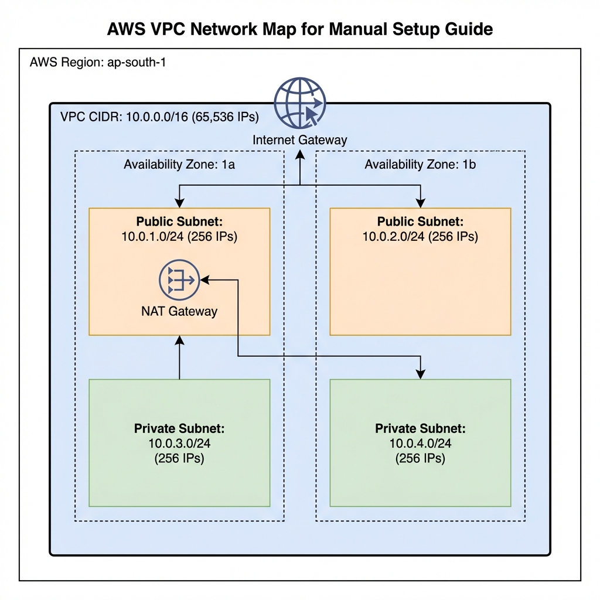
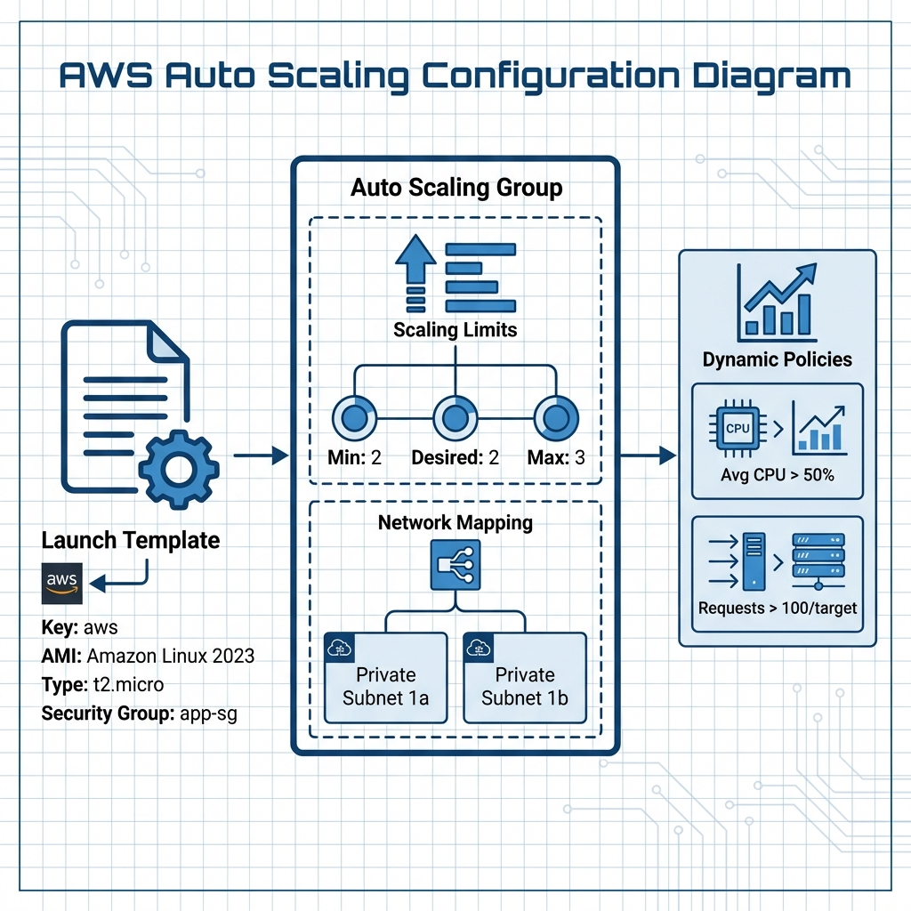

# Manual AWS Console Setup Guide

This guide describes how to manually recreate the entire infrastructure using the AWS Management Console.

**Region**: `ap-south-1` (Mumbai)
**Project Name**: `srinivas-garden`

---

## 0. Prerequisite: Preparing SSL Certificates

AWS often requires the **Certificate Body** and **Certificate Chain** to be separate files, even if your provider gave you a single `tls.crt`.

**If you have a single `tls.crt` file containing multiple certificates:**

1.  Open `tls.crt` in a text editor.
2.  **Certificate Body**: The _first_ block (`-----BEGIN CERTIFICATE-----` to `-----END CERTIFICATE-----`). Save as `body.pem`.
3.  **Certificate Chain**: All subsequent blocks. Save as `chain.pem`.
4.  **Private Key**: Your `tls.key` file stays as is.

**Command Line (Mac/Linux):**

```bash
# Split a bundle into separate files
awk 'BEGIN {c=0} /BEGIN CERTIFICATE/ {c++} { out="cert" c ".pem"; print > out }' tls.crt

# cert1.pem = Certificate Body
# cert2.pem (+ cert3.pem etc.) = Certificate Chain
```

---

## 1. Networking (VPC)

**Goal**: Create a secure network with public and private zones.



### Step 1.1: Create VPC

1. Go to **VPC Dashboard** -> **Your VPCs** -> **Create VPC**.
2. **Name tag**: `srinivas-garden-vpc`
3. **IPv4 CIDR block**: `10.0.0.0/16`
   - _Note_: This provides **65,536 IP addresses**.
4. **Tenancy**: Default.
5. Click **Create VPC**.

### Step 1.2: Create Subnets

Go to **Subnets** -> **Create subnet**. Select your VPC.

| Name               | AZ            | IPv4 CIDR     | Type (Logical) | IPs Available |
| :----------------- | :------------ | :------------ | :------------- | :------------ |
| `public-subnet-1`  | `ap-south-1a` | `10.0.1.0/24` | Public         | 251           |
| `public-subnet-2`  | `ap-south-1b` | `10.0.2.0/24` | Public         | 251           |
| `private-subnet-1` | `ap-south-1a` | `10.0.3.0/24` | Private        | 251           |
| `private-subnet-2` | `ap-south-1b` | `10.0.4.0/24` | Private        | 251           |

### Step 1.3: Internet Gateway (IGW)

1. **Internet Gateways** -> **Create internet gateway**.
2. Name: `srinivas-garden-igw`.
3. **Attach** it to your VPC.

### Step 1.4: NAT Gateway

1. **NAT Gateways** -> **Create NAT gateway**.
2. Name: `srinivas-garden-nat`.
3. Subnet: `public-subnet-1`.
4. Connectivity type: `Public`.
5. **Allocate Elastic IP**.
6. Click **Create**.

### Step 1.5: Route Tables

1. **Public Route Table**:
   - Create table `public-rt`.
   - Add Route: `0.0.0.0/0` -> Target: `Internet Gateway`.
   - **Subnet Associations**: Edit and select both `public-subnet-1` and `public-subnet-2`.
2. **Private Route Table**:
   - Create table `private-rt`.
   - Add Route: `0.0.0.0/0` -> Target: `NAT Gateway`.
   - **Subnet Associations**: Edit and select both `private-subnet-1` and `private-subnet-2`.

---

## 2. Security Groups

**Goal**: Define firewall rules.

1. **ALB Security Group** (`alb-sg`):
   - **Inbound**:
     - Type: `HTTPS`, Port: `443`, Source: `0.0.0.0/0` (Anywhere).
     - Type: `HTTP`, Port: `80`, Source: `0.0.0.0/0` (Anywhere).
2. **Bastion Security Group** (`bastion-sg`):
   - **Inbound**: Type: `SSH`, Port: `22`, Source: `0.0.0.0/0` (Or your My IP).
3. **App Security Group** (`app-sg`):
   - **Inbound**:
     - Type: `HTTP`, Port: `80`, Source: **Security Group ID of alb-sg** (Only allow Load Balancer).
     - Type: `SSH`, Port: `22`, Source: **Security Group ID of bastion-sg**.

---

## 3. Compute (ASG & Launch Template)

**Goal**: Automatically scale servers based on load.



### Step 3.1: Launch Template

1. **EC2** -> **Launch Templates** -> **Create launch template**.
2. Name: `srinivas-garden-lt`.
3. **AMI**: Amazon Linux 2023.
4. **Instance type**: `t2.micro` or `t3.micro`.
5. **Key pair**: `aws`.
6. **Network settings**:
   - Select `Existing security group`: `app-sg`.
7. **Advanced details (User Data)**:
   - Paste the script to install Apache/Nginx (simulated web server).

### Step 3.2: Auto Scaling Group

1. **EC2** -> **Auto Scaling Groups** -> **Create Auto Scaling group**.
2. Name: `srinivas-garden-asg`.
3. **Launch Template**: Select `srinivas-garden-lt`.
4. **Network**:
   - VPC: `srinivas-garden-vpc`.
   - Subnets: Select `private-subnet-1` and `private-subnet-2`.
5. **Load Balancing**: Attach to a new load balancer (See Section 4) or skip and attach later.
6. **Group Size**:
   - Desired: `2`
   - Minimum: `2`
   - Maximum: `3`
7. **Scaling Policies**:
   - Target Tracking Policy: Average CPU Utilization -> Target `50`.

---

## 4. Load Balancer & Certificates

**Goal**: Secure traffic distribution.


### Step 4.1: Import Certificate (ACM)

1. **Certificate Manager** -> **Import a certificate**.
2. Paste body (`tls.crt`), private key (`tls.key`), and chain.
3. Click **Import**. Copy the **ARN**.

### Step 4.2: Target Group

1. **EC2** -> **Target Groups** -> **Create target group**.
2. Type: `Instances`.
3. Name: `srinivas-garden-tg`.
4. Protocol: `HTTP`, Port: `80`.
5. VPC: `srinivas-garden-vpc`.
6. Health Check: Path `/`.

### Step 4.3: Application Load Balancer

1. **EC2** -> **Load Balancers** -> **Create Load Balancer** -> **Application Load Balancer**.
2. Name: `srinivas-garden-alb`.
3. Scheme: `Internet-facing`.
4. **Network mapping**: Select VPC and **Public Subnets** (1 & 2).
5. **Security groups**: Select `alb-sg`.
6. **Listeners**:
   - **HTTPS:443**: Forward to `srinivas-garden-tg`.
     - **Secure Listener Settings**: Select the Certificate imported in Step 4.1.
   - **HTTP:80**: Edit to "Redirect to HTTPS:443" (optional advanced action) or just Forward to TG.

---

## 5. DNS (Route 53)

**Goal**: Point your domain to the Load Balancer.

### Step 5.1: Create Hosted Zone

1. **Route 53** -> **Hosted zones** -> **Create hosted zone**.
2. Domain name: `garden.srinivaskona.life`.
3. Type: `Public hosted zone`.

### Step 5.2: Create Record

1. Click **Create record**.
2. Record name: Leave empty (for root) or `www`.
3. Record type: `A` (Routes traffic to an IPv4 address).
4. **Alias**: Toggle `Yes`.
5. **Route traffic to**: Alias to Application and Classic Load Balancer -> Region `ap-south-1` -> Select your ALB (`srinivas-garden-alb`).
6. Click **Create records**.

### Step 5.3: Update Registrar

1. Note the **NS** (Nameserver) records in the Hosted Zone.
2. Log into GoDaddy/Namecheap.
3. Update the Nameservers to match the AWS Route 53 values.
