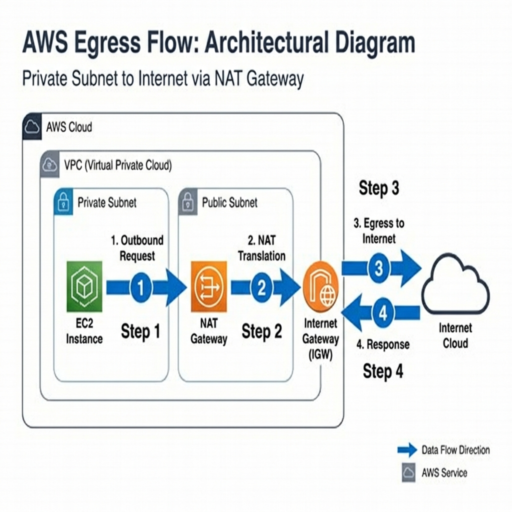

# 🧠 The AWS Data Flow: Architectural Explanations

This document provides a detailed, step-by-step technical explanation of the traffic flows within our secure architecture. Each section corresponds to the numbered steps in the accompanying diagrams.

---

## Flow 1: Ingress (Secure User Access)

**Goal:** Securely route external HTTPS traffic to private application servers.

### Step-by-Step Breakdown

1.  **Step 1: HTTPS Request**
    - The user initiates a secure request (e.g., `https://garden.srinivaskona.life`) from their browser.
    - This traffic is encrypted using TLS (Transport Layer Security).

2.  **Step 2: DNS Resolution**
    - The request first hits **AWS Route 53**, which acts as the phonebook.
    - Route 53 resolves the domain name to the IP addresses of the **Application Load Balancer (ALB)**.
    - _Note:_ The DNS bypasses the Internet Gateway; it is purely resolution logic.

3.  **Step 3: Ingress**
    - The traffic enters variables via the **Internet Gateway (IGW)** attached to the VPC.
    - It reaches the **ALB** located in the **Public Subnet**.
    - **Action**: The ALB uses the stored SSL Certificate (ACM) to **Decrypt** the traffic (Termination). It inspects the packet to determine routing rules.

4.  **Step 4: Forwarding (Decrypted Traffic)**
    - The ALB establishes a new, internal connection to the backend **EC2 Instance** in the **Private Subnet**.
    - **Security**: The traffic travels over Port 80 (HTTP) inside the secure VPC network.
    - The Private Instance only accepts traffic from the ALB's Security Group, rejecting all other direct access.

---

## Flow 2: Egress (Outbound Internet Access)

**Goal:** Allow private instances to download updates (e.g., `yum update`) without exposing them to inbound attacks.

### Step-by-Step Breakdown

1.  **Step 1: Outbound Request**
    - A Private EC2 instance needs to reach the internet (e.g., to Google).
    - Since it has no Public IP, it sends the request to the **NAT Gateway** defined in its Route Table.
    - _Internal Route:_ `0.0.0.0/0 -> nat-gateway-id`.

2.  **Step 2: NAT Translation**
    - The NAT Gateway (living in the Public Subnet) receives the packet.
    - **Source NAT (SNAT)**: It replaces the Private IP of the sender with its own **Elastic IP (Public IP)**.
    - It keeps a record of this mapping in its connection table.

3.  **Step 3: Egress to Internet**
    - The NAT Gateway sends the now-public packet out through the **Internet Gateway (IGW)** to the destination.

4.  **Step 4: Response**
    - The external server responds to the NAT Gateway's Public IP.
    - The NAT Gateway marks the return packet, identifies the original sender from its table, and forwards the response back to the Private Instance.

---

## Flow 3: Administrative Access (Bastion Host)

**Goal:** Provide secure SSH access to private servers for administrators.

### Step-by-Step Breakdown

1.  **Step 1: External SSH Connection**
    - The Administrator initiates an SSH connection (`ssh -i key.pem user@bastion-ip`).
    - **Security Boundary**: The **Bastion Host** (in the Public Subnet) allows this connection **ONLY** from the Administrator's specific IP address (whitelisted in the Security Group).

2.  **Step 2: Traffic Forwarding (Jump)**
    - Once authenticated on the Bastion Host, the Administrator is effectively "inside" the VPC network.
    - The Bastion Host acts as a "Jump Server".

3.  **Step 3: Internal SSH**
    - From the Bastion, the Administrator initiates a second SSH connection to the **Private Instance**'s private IP (`ssh user@10.0.x.x`).
    - **Key Forwarding**: The Administrator's SSH Agent forwards their credentials securely, so private keys are never stored on the Bastion itself.
    - The Private Instance Security Group allows Port 22 connections **ONLY** from the Bastion Host's Security Group ID.
