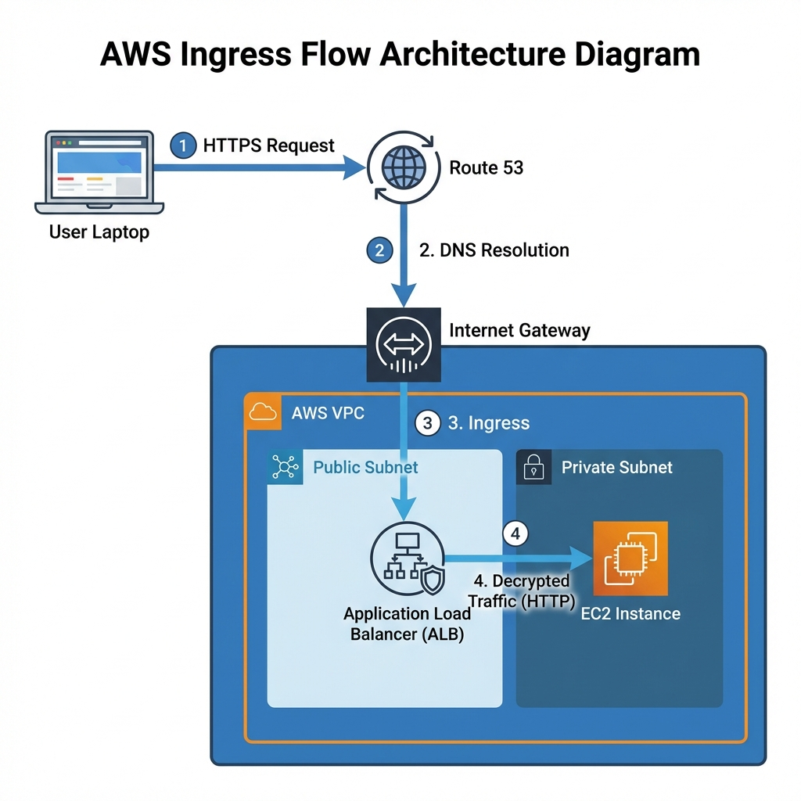
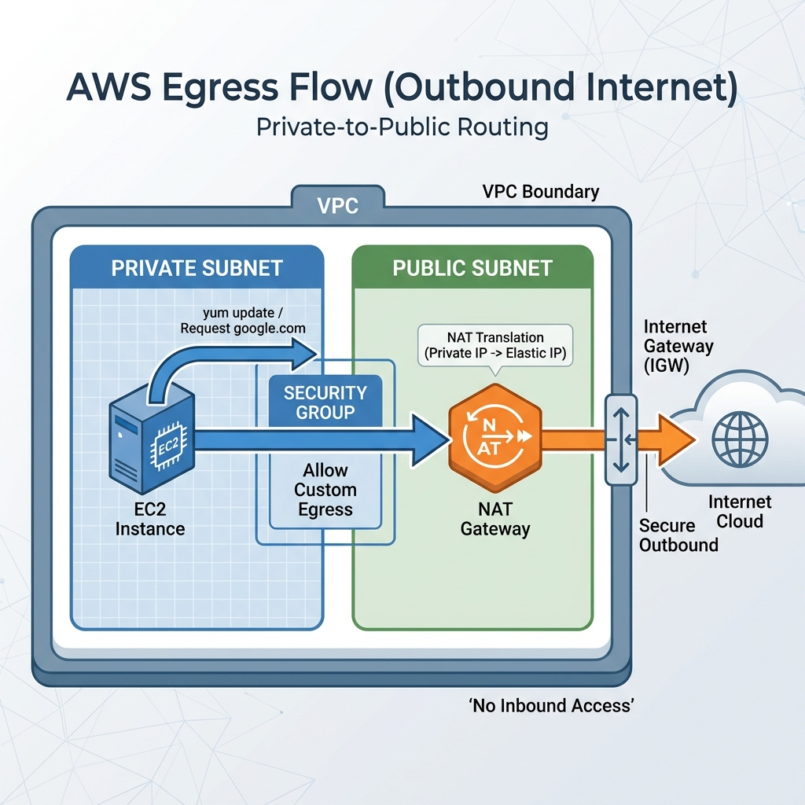
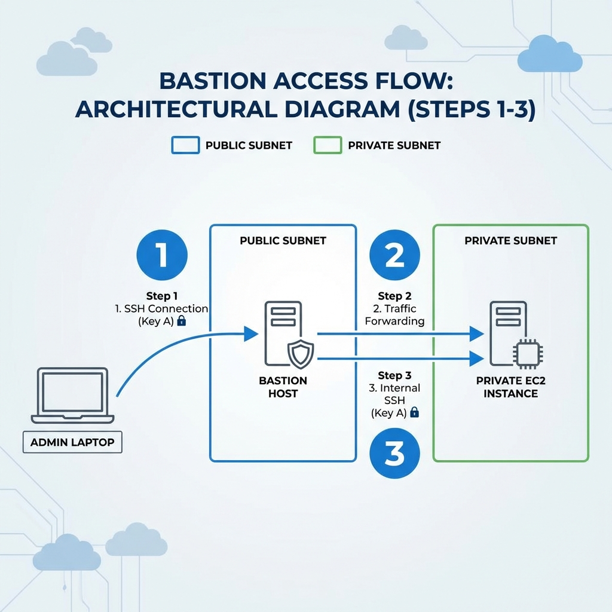

# 🧠 The AWS Data Flow: "Nano Banana" Explanation

This document explains the complex flow of traffic in our secure architecture using the simplest possible terms (The "Nano Banana" approach), alongside architect-level diagrams for deep understanding.

---

## 🍌 flow 1: "The User Visits the Site" (Ingress)

**Goal:** A user wants to see your website securely (`https://`).

### The Architect's View

### The "Nano Banana" Steps

1.  **The Lock (TLS)**:
    - User sends a locked box (HTTPS request) to `https://garden...`.
    - Only the **Load Balancer (ALB)** has the key (SSL Certificate) to open it.
2.  **The Decryption**:
    - The ALB sits in the **Public Subnet** (it has a public address).
    - It unlocks the box, looks inside ("Oh, you want `index.html`"), and re-packages it.
3.  **The Hand-off**:
    - The ALB sends the _unlocked_ request (HTTP) to the **Private Server** hidden in the back room.
    - **Security Rule**: The Private Server ignores _everyone_ except the ALB.

---

## 🍌 Flow 2: "The Server Needs Updates" (Egress)

**Goal:** Your Private Server needs to download a security patch from `google.com`.

### The Architect's View

### The "Nano Banana" Steps

1.  **The Problem**:
    - The Private Server has NO public IP. It's like a computer with no modem. It can shout "Help!", but the internet can't hear it.
2.  **The Middleman (NAT Gateway)**:
    - The server sends the request to the **NAT Gateway** (which lives in the Public Subnet).
3.  **The Translation**:
    - The NAT Gateway says, "I'll handle this."
    - It stamps its own _Public IP_ on the letter and mails it to Google.
    - Google replies to the NAT Gateway.
    - The NAT Gateway hands the reply back to the Private Server.

---

## 🍌 Flow 3: "The Admin Needs to Fix Code" (Access)

**Goal:** You (the Admin) need to log in to fixed a bug on the Private Server.

### The Architect's View

### The "Nano Banana" Steps

1.  **The Bouncer (Bastion Host)**:
    - You cannot walk directly into the secure vault (Private Subnet).
    - You SSH into the **Bastion Host** (Jump Server) in the Public Lobby.
    - _Security_: The Bastion only accepts keys from _your_ IP address.
2.  **The Jump**:
    - Once you are inside the Bastion, you are "inside the building".
    - From the Bastion, you SSH _again_ to the Private Server (`10.0.3.15`).
    - The Private Server allows this because it trusts the Bastion.

---

## 🛡️ Security Group "Skeleton" (The Rules)

Here is the logic that enforces these flows.

### 1. ALB Security Group (`sri-alb-sg`)

- **Allow Inbound**: Port `443` (HTTPS) from `0.0.0.0/0` (Everyone).
- **Allow Outbound**: Everything (to talk to instances).

### 2. App Instance Security Group (`sri-app-sg`)

- **Allow Inbound**: Port `80` (HTTP) **ONLY from `sri-alb-sg`**.
- **Allow Inbound**: Port `22` (SSH) **ONLY from `sri-bastion-sg`**.
- _Result_: If a hacker tries to hit the instance directly, they are blocked.

### 3. Bastion Security Group (`sri-bastion-sg`)

- **Allow Inbound**: Port `22` (SSH) **ONLY from Your Personal IP**.
