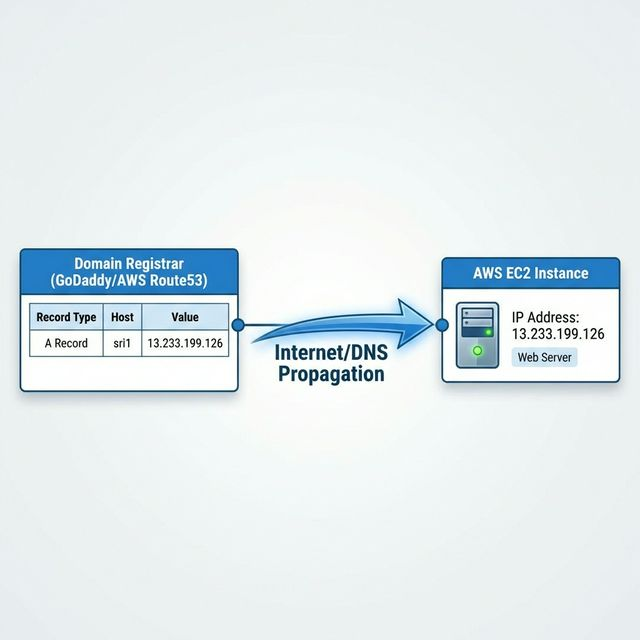

# Master Operation Manual: Nginx Multi-Domain Setup

This document serves as the **Single Source of Truth** for the deployment, management, and maintenance of the Nginx Reverse Proxy hosting `sri1.srinivaskona.life` and `sri2.srinivaskona.life`.

---

## 📋 Table of Contents

1.  [Phase 1: AWS Infrastructure Provisioning](#phase-1-aws-infrastructure-provisioning)
2.  [Phase 2: Domain DNS Setup](#phase-2-domain-dns-setup)
3.  [Phase 3: Nginx Installation & Check](#phase-3-nginx-installation--check)
4.  [Phase 4: Backend Service Configuration](#phase-4-backend-service-configuration)
5.  [Phase 5: Nginx Reverse Proxy Config](#phase-5-nginx-reverse-proxy-config)
6.  [Phase 6: SSL Security (The Architect's Guide)](#phase-6-ssl-security-the-architects-guide)
7.  [Architectural Request Flow (Visual)](#architectural-request-flow-visual)
8.  [FAQ: Verification & IP Access](#faq-verification--ip-access)

---

## Phase 1: AWS Infrastructure Provisioning

**Goal**: Get a server running and accessible.

### 1.1 Launch EC2 Instance

1.  **Login to AWS Console** -> **EC2 Dashboard** -> **Launch Instances**.
2.  **OS Image**: Amazon Linux 2023.
3.  **Instance Type**: `t2.micro` (Free Tier).
4.  **Key Pair**: Download and save your `.pem` file.

### 1.2 Security Group (Firewall)

Configure the firewall rules to allow traffic.

| Protocol  | Port | Source             | Purpose            |
| :-------- | :--- | :----------------- | :----------------- |
| **SSH**   | 22   | My IP              | Admin Access       |
| **HTTP**  | 80   | Anywhere 0.0.0.0/0 | Web Traffic        |
| **HTTPS** | 443  | Anywhere 0.0.0.0/0 | Secure Web Traffic |

**Note**: Do **NOT** open ports 8002/8003. They remain internal.

### 1.3 SSH Connection

```bash
# Set permissions
chmod 400 aws.pem

# Connect
ssh -i aws.pem ec2-user@<YOUR_PUBLIC_IP>
```

---

## Phase 2: Domain DNS Setup

**Goal**: Point your domains to the AWS Server.



1.  Log in to your **Domain Registrar** (e.g., GoDaddy, Namecheap, Route53).
2.  Add **A Records**:
    - `sri1` -> `13.233.199.126`
    - `sri2` -> `13.233.199.126`

---

## Phase 3: Nginx Installation & Check

**Goal**: Ensure the Web Server software is installed and running.

```bash
# 1. Update System
sudo dnf update -y

# 2. Install Nginx
sudo dnf install nginx -y

# 3. Start & Enable
sudo systemctl start nginx
sudo systemctl enable nginx

# 4. Verify (Should see "Active: running")
sudo systemctl status nginx
```

_Check_: Visit `http://13.233.199.126` in your browser. You should see the "Welcome to Nginx" page.

---

## Phase 4: Backend Service Configuration

**Goal**: Create the actual websites running on Ports 8002 and 8003.

### 4.1 Create Content Directories

```bash
sudo mkdir -p /var/www/sri1
sudo mkdir -p /var/www/sri2
```

### 4.2 Start Python Backends

We use Python's built-in HTTP server for these backends.

```bash
# Start Sri1 on Port 8002 (Background)
nohup python3 -m http.server 8002 -d /var/www/sri1 > /var/log/sri1.log 2>&1 &

# Start Sri2 on Port 8003 (Background)
nohup python3 -m http.server 8003 -d /var/www/sri2 > /var/log/sri2.log 2>&1 &
```

---

## Phase 5: Nginx Reverse Proxy Config

**Goal**: Configure Nginx to route traffic to the Python ports based on domain name.

### ❓ FAQ: "Why is the file named `srinivaskona.conf`?"

You can name this file **anything you want**, as long as it ends in `.conf`.

- **Why?**: The main Nginx config (`/etc/nginx/nginx.conf`) has a line `include /etc/nginx/conf.d/*.conf;`.
- **Best Practice**: Name it after your project (e.g., `srinivas.conf`, `web-project.conf`) so you know what it contains.

### 5.1 Create Config File

File: `/etc/nginx/conf.d/srinivaskona.conf`

```nginx
server {
    listen 80;
    server_name sri1.srinivaskona.life;
    location / {
        proxy_pass http://localhost:8002;
    }
}

server {
    listen 80;
    server_name sri2.srinivaskona.life;
    location / {
        proxy_pass http://localhost:8003;
    }
}
```

### 5.2 Apply Changes

```bash
sudo nginx -t   # Test syntax
sudo systemctl restart nginx
```

---

## Phase 6: SSL Security (The Architect's Guide)

**Goal**: Understand exactly how the "Green Padlock" is created and verified.

### 6.0 Install Certbot (The Tool)

Before you can get a certificate, you must install the "Robot" that talks to the Authority.

```bash
# 1. Update the OS package manager
sudo dnf update -y

# 2. Install Certbot and the Nginx plugin
# - certbot: The core tool
# - python3-certbot-nginx: The plugin that knows how to read/edit your nginx.conf
sudo dnf install certbot python3-certbot-nginx -y

# 3. Verify it's installed
certbot --version
```

### 6.1 The "Proof of Ownership" Architecture

We use a key tool called **Certbot**.

1.  **The Challenge**: You run `certbot`. It contacts **Let's Encrypt (The Authority)** and says "I want a cert for `sri1`".
2.  **The Secret Task**: The Authority replies: "Okay, prove it. Create a file named `abc-123` with the text `secret-code` on your server."
3.  **The Execution**: Certbot secretly places this file in your web folder:
    - Path: `/.well-known/acme-challenge/abc-123`
4.  **The Verification Check**: The Authority (from the cloud) tries to download `http://sri1.../.well-known/...`.
    - It hits your **Nginx Server**.
    - Nginx serves the file.
5.  **The Reward**: The Authority sees the file matches. It creates the **SSL Certificate** and sends it to Certbot.

### 6.2 Automating it (The Command)

```bash
sudo certbot --nginx -d sri1.srinivaskona.life -d sri2.srinivaskona.life
```

- **--nginx**: Tells Certbot "I am using Nginx. Please automatically edit my `.conf` file to add `listen 443 ssl` and point to the key files."

### 6.3 Verification: How to see ALL certs?

To list every certificate managed by this server:

```bash
sudo certbot certificates
```

**Sample Output:**

```text
Found the following certs:
  Certificate Name: sri1.srinivaskona.life
    Domains: sri1.srinivaskona.life sri2.srinivaskona.life
    Expiry Date: 2026-05-04 10:00:00+00:00 (VALID: 87 days)
    Certificate Path: /etc/letsencrypt/live/sri1.srinivaskona.life/fullchain.pem
```

_Note_: Often Certbot groups multiple domains into one certificate (SANs). Here, one cert covers both `sri1` and `sri2`.

### 6.4 Automate Everything (The Architect's Script)

We have created `automate_nginx_ssl.sh` to handle HTML generation, Nginx config, and SSL all in one go.

**🚀 Professional One-Liner Install**
Run this on any fresh EC2 instance to set up a domain instantly:

```bash
curl -sL https://raw.githubusercontent.com/srinivaskona7/aws-project/main/poc/nginx-multiconfig/automate_nginx_ssl.sh | sudo bash -s -- custom.domain.com
```

**Mode 1: Interactive (Wizard)**
Run without arguments to be prompted for domains:

```bash
./automate_nginx_ssl.sh
# Enter Domain Name: srinivas3.srinivaskona.life
```

**Mode 2: Direct Execution**
Pass multiple domains as arguments:

```bash
./automate_nginx_ssl.sh domain1.com domain2.com
```

**What it does:**

1.  **Auto-Install**: Installs Nginx & Certbot if missing.
2.  **Generates Content**: Creates `/var/www/slug/index.html`.
3.  **Configures Nginx**: Creates `/etc/nginx/conf.d/custom-domain.conf` (slug-based).
4.  **Secures**: Runs `certbot` to get the SSL certificate.
5.  **Validates**: Checks syntax and reloads Nginx.

### 6.5 Generated File Templates

Here is exactly what the script creates for you:

**A. The Web Page (`/var/www/slug/index.html`)**

```html
<html>
  <head>
    <title>srinivas3.srinivaskona.life</title>
  </head>
  <body>
    <h1>srinivas3.srinivaskona.life (srinivas3-srinivaskona-life)</h1>
  </body>
</html>
```

**B. The Nginx Config (`/etc/nginx/conf.d/slug.conf`)**

```nginx
server {
    listen 80;
    server_name srinivas3.srinivaskona.life;
    root /var/www/srinivas3-srinivaskona-life;
    index index.html;

    location / {
        try_files $uri $uri/ =404;
    }
}
```

_(Note: Certbot will automatically add the SSL/443 lines to this file after it runs.)_

---

## Architectural Request Flow (Visual)

This diagram illustrates exactly how a request for `sri1` is routed differently from `sri2`.


### The Journey Step-by-Step

1.  **User Input**: User types `https://sri1.srinivaskona.life`.
2.  **Encrypted Tunnel**: The request hits Nginx on **Port 443**.
3.  **SNI (Server Name Indication)**: Nginx reads the encrypted header to see the target is `sri1`.
4.  **Routing Decision**: Nginx checks its config: "Ah, `sri1` goes to local port 8002".
5.  **Upstream Handoff**: Nginx sends the request to the Python backend running on `localhost:8002`.
6.  **Response**: Python replies to Nginx -> Nginx replies to User.

---

## FAQ: Verification & IP Access

### Q1: Can I access the site using the IP Address? (e.g. `https://13.233.199.126`)

**No, you cannot.**

- **Why?**: SSL Certificates are tied to **Domain Names**, not IP addresses. If you visit the IP directly, the browser will warn "Not Secure" because the certificate says "I am sri1.srinivaskona.life", but the URL bar says "13.233.199.126". It's a mismatch.

### Q2: Can I access the ports directly? (e.g. `http://13.233.199.126:8002`)

**No.**

- **Why?**: Your **AWS Security Group** only opens Port 80 and 443. Port 8002 is blocked from the outside world firewall. This is a **Security Best Practice**. Only Nginx (running inside the server) allows access to 8002 via `localhost`.

### Q3: How do I verify if the ports are open properly?

Since you can't reach them from outside, verify them **from inside** the server:

```bash
# Check if Python is listening
curl http://localhost:8002
curl http://localhost:8003
```

If these return HTML, your backends are perfect.

---

**Maintained By**: DevOps Team
**Docs Location**: `/home/ec2-user/docs/`
