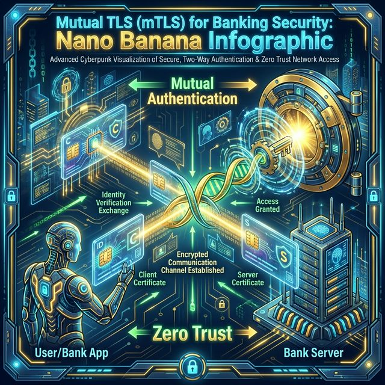
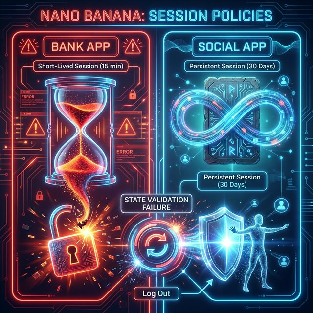
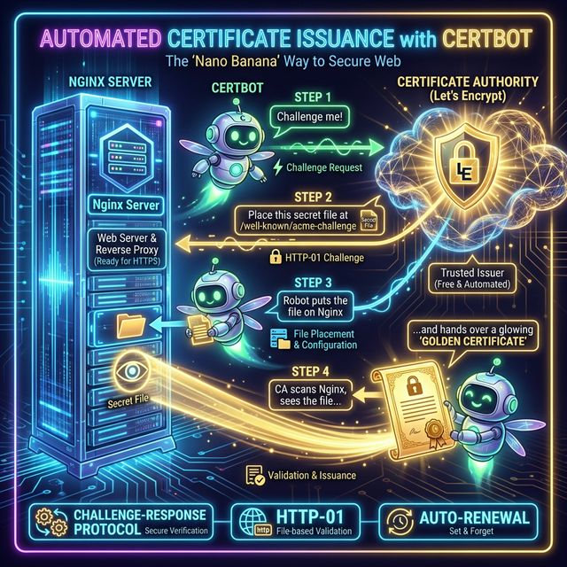

# Architectural TLS & Request Flow: `sri1.srinivaskona.life`

## Visual Architecture


## Secure Connection Lifecycle


## Table of Contents

1. [Phase 1: DNS Resolution](#phase-1-dns-resolution)
2. [Phase 2: TCP Connection](#phase-2-tcp-connection)
3. [Phase 3: TLS Handshake (The Security Layer)](#phase-3-tls-handshake-the-security-layer)
4. [Phase 4: HTTP Request Lifecycle (Inside the Tunnel)](#phase-4-http-request-lifecycle-inside-the-tunnel)
5. [Data Inspection: Headers & Cookies](#data-inspection-headers--cookies)

---

## Phase 1: DNS Resolution

**"Finding the Address"**
Before any data can be sent, the browser must find the server's IP address.

1.  **Query**: Browser asks DNS Resolver for `sri1.srinivaskona.life`.
2.  **Response**: DNS Resolver returns `13.233.199.126`.
3.  **Result**: Browser now knows _where_ to send the packets.

---

## Phase 2: TCP Connection

**"Plugging in the Cable"**
A reliable connection is established using the 3-Way Handshake.

### The Handshake Steps

1.  **SYN**: Browser sends a synchronization request to `13.233.199.126:443`.
2.  **SYN-ACK**: Nginx acknowledges and agrees to connect.
3.  **ACK**: Browser confirms. Connection is open.

### Architect's Notebook: The Terms Defined

| Term        | Full Name                   | The "Architectural" Meaning                                                                                                                                                                                                                                        |
| :---------- | :-------------------------- | :----------------------------------------------------------------------------------------------------------------------------------------------------------------------------------------------------------------------------------------------------------------- |
| **SYN**     | **Synchronize**             | **"Let's Align Clocks."**<br>The client picks a random sequence number (e.g., 5000) and tells the server: _"I am going to start sending data counting from 5000."_<br>**Why?** This prevents confusion from old, delayed packets from previous sessions.           |
| **SYN-ACK** | **Synchronize-Acknowledge** | **"I Hear You + I'm Ready."**<br>The server says: _"I received your 5000. Next time send 5001 (ACK). Also, I will start my counting at 9000 (SYN)."_<br>**Why?** This proves the server is alive, willing to talk, and has allocated memory for this conversation. |
| **ACK**     | **Acknowledge**             | **"Deal Confirmed."**<br>The client responds: _"Understood. I'll expect 9001 next."_<br>**Why?** The connection is now **ESTABLISHED**. Both sides know strictly which byte comes next. If a packet is lost, they know exactly what to resend.                     |

> **Why do we need this?**
> UDP (like streaming video) just blasts data. TCP requires this handshake to guarantee **Reliability** and **Ordering**. It ensures that file part #50 doesn't arrive before file part #1, and if part #10 is missing, the system knows to ask for it again.

---

## Phase 3: TLS Handshake (The Security Layer)

**"Establishing the Secret Language"**
This is where the encryption key (Session Token) is negotiated.

1.  **Client Hello**: "I speak TLS 1.2/1.3. I want to talk to `sri1.srinivaskona.life` (SNI)."
2.  **Server Hello**: "Let's use TLS 1.3. Here is my ID card (Certificate)."
    - **Certificate**: Issued by _Let's Encrypt_ for `sri1.srinivaskona.life`.
3.  **Validation**: Browser checks:
    - Is the certificate expired?
    - Is it really for `sri1.srinivaskona.life`?
    - Is _Let's Encrypt_ a trusted authority? (Yes)
4.  **Key Exchange**: Both parties independently calculate the same **Master Secret (Session Key)** using random numbers exchanged earlier and the server's public key.
5.  **Tunnel Established**: From this point on, all traffic is opaque to outsiders.

---

## Phase 4: HTTP Request Lifecycle (Inside the Tunnel)

**"The Actual Conversation"**
Now that the secure tunnel exists, the application logic happens.

### 1. The Request (Browser -> Nginx)

The browser sends the following inside the encrypted tunnel:

```http
GET /dashboard HTTP/1.1
Host: sri1.srinivaskona.life
User-Agent: Mozilla/5.0 (Macintosh; Intel Mac OS X 10_15_7)
Cookie: auth_token=xyz789; preference=dark_mode
Accept: text/html
```

### 2. Nginx Processing (The Proxy)

Nginx sits at the edge. It decrypts the packet and looks at the configuration:

1.  **SNI Match**: It sees the request is for `sri1...`, so it loads the correct `server { ... }` block.
2.  **Proxying**: It opens a _new, separate_ connection to the backend (`localhost:8002`).

### 3. The Backend Request (Nginx -> App)

Nginx forwards the request to your Node/Python/Java app, adding vital headers:

```http
GET /dashboard HTTP/1.1
Host: sri1.srinivaskona.life
X-Real-IP: 203.0.113.45  <-- The USER'S true IP
X-Forwarded-For: 203.0.113.45
X-Forwarded-Proto: https
Connection: close
```

### 4. The Response (App -> Nginx -> Browser)

The app processes the logic (e.g., checks database) and replies:

```http
HTTP/1.1 200 OK
Content-Type: text/html; charset=utf-8
Set-Cookie: auth_token=xyz789; Secure; HttpOnly
Server: Nginx

<html>...Hello Srinivas...</html>
```

Nginx encrypts this entire block and sends it back to the user.

---

## Data Inspection: Headers & Cookies

Summary of key data utilized during the `sri1.srinivaskona.life` session.

| Type         | Header Name                    | Purpose & Flow                                                                                                                          |
| :----------- | :----------------------------- | :-------------------------------------------------------------------------------------------------------------------------------------- |
| **Identity** | `Host: sri1.srinivaskona.life` | **Critical.** Tells Nginx which website to serve. Without this, Nginx wouldn't know to pick block #1 vs block #2.                       |
| **Security** | `Set-Cookie`                   | **Server -> Browser.** Tells browser to store a secret (Session ID). Marked `Secure` to ensure it continues to only be sent over HTTPS. |
| **State**    | `Cookie`                       | **Browser -> Server.** Browser automatically includes this in every subsequent request so the user stays logged in.                     |
| **Tracking** | `X-Real-IP`                    | **Nginx -> Backend.** Ensures your backend logs the _user's_ IP (`203...`) instead of Nginx's IP (`127.0.0.1`).                         |
| **Security** | `Strict-Transport-Security`    | **Server -> Browser.** Enforces HTTPS. "Don't you dare try HTTP for the next year."                                                     |

---

## Deep Dive: The Networking Stack (OSI Model)

**Architectural Perspective: How `sri1.srinivaskona.life` travels through the wires.**

When a beginner sees "The site loaded," an Architect sees data moving through 7 distinct layers. Let's trace a single packet from your laptop to `13.233.199.126`.

### The 7 Layers of Connectivity

| Layer | Name             | What it handles         | In Our Example (`sri1...`)                                                                                                    |
| :---- | :--------------- | :---------------------- | :---------------------------------------------------------------------------------------------------------------------------- |
| **7** | **Application**  | **Human Data**          | **HTTP / HTTPS**. Converting "GET /" into a format the browser understands (HTML, JSON).                                      |
| **6** | **Presentation** | **Encoding/Encryption** | **TLS / SSL**. Encrypting `Hello` into `xhj7#9s0d` so no one on the wire can read it.                                         |
| **5** | **Session**      | **Convos**              | **Session ID**. Keeping the connection open while you browse multiple pages.                                                  |
| **4** | **Transport**    | **Reliability (TCP)**   | **TCP Port 443**. Breaking the photo of your cat into 500 tiny packets and numbering them #1-#500.                            |
| **3** | **Network**      | **Routing (IP)**        | **IP: 13.233.199.126**. Similar to a GPS using zip codes. Routers read this to know "Send this packet to India (AWS Mumbai)." |
| **2** | **Data Link**    | **Local Switching**     | **MAC Address**. Your laptop talking to your WiFi router. "Here, take this packet to the modem."                              |
| **1** | **Physical**     | **Physics**             | **WiFi / Fiber**. The actual radio waves or light pulses traveling under the ocean.                                           |

---

### Protocol Architecture: TCP vs. UDP

Why do we use TCP for websites? Why not the faster UDP?

#### 1. TCP (Transmission Control Protocol) -> **"The Reliable Accountant"**

- **Architecture**: Connection-Oriented.
- **Philosophy**: "Every byte matters."
- **Mechanism**:
  - **SYN/ACK**: "Are you there? Yes. Okay." (Handshake)
  - **Sequencing**: "This is packet #5. Did you get #4?"
  - **Retransmission**: "You didn't get #4? I'll send it again."
- **Use Case**: **Websites (HTTP), Emails (SMTP), Files (FTP)**.
  - _Why?_ You don't want a webpage to load with missing words or a zip file to be corrupt.

#### 2. UDP (User Datagram Protocol) -> **"The Fast Firehose"**

- **Architecture**: Connectionless (Fire and Forget).
- **Philosophy**: "Speed is everything. If you miss a drop, too bad."
- **Mechanism**:
  - **No Handshake**: Just starts screaming data.
  - **No Recovery**: If a packet drops, it's gone forever.
- **Use Case**: **Video Streaming, Online Gaming, Voice Calls (VoIP)**.
  - _Why?_ If you miss one frame in a video, you don't want the video to _pause_ while we fetch it. You just skip it and keep moving.

---

### Anatomy of a Packet: "What exactly is SYN?"

You asked: _"Is that data packets for sync and ack?"_

**Answer: NO.**
SYN and ACK are **FLAGS** in the header, not payload data. Think of a TCP Packet like a physical letter envelope:

1.  **Header (The Envelope Info)**
    - **Source IP**: Your Laptop
    - **Dest IP**: `13.233.199.126`
    - **Dest Port**: 443
    - **Sequence Number**: 5000
    - **FLAGS (The Status switches)**:
      - `[x] SYN` (I want to connect)
      - `[ ] ACK` (I acknowledge)
      - `[ ] PSH` (Here is data)
      - `[ ] FIN` (I'm done)

2.  **Payload (The Letter Inside)**
    - **For SYN Packet**: **EMPTY**. (Size: 0 bytes of data). It's _just_ the envelope saying "Hello".
    - **For HTTP Packet**: Contains "GET / HTTP/1.1...".

---

## Real-World Scenarios: Sessions & Live Streaming

How does this architecture handle continuous data like a user session or a live video?

### 1. The "Session" Illusion (State over Stateless)

**The Problem:** HTTP is stateless. When you send Packet #50, the server has already forgotten Packet #49.
**The Solution:** The **Session ID (Cookie)**.

- **Step 1 (Login):** You send "User: Srinivas, Pass: \*\*\*".
- **Step 2 (The Stamp):** Server verifies you and creates a unique ID `abc-123-xyz` in its memory (RAM or Redis). It sends this back as a `Set-Cookie: session=abc-123-xyz`.
- **Step 3 (The Persistence):**
  - **Packet #50 (GET /profile):** Your browser _automatically_ injects `Cookie: session=abc-123-xyz`.
  - **Server Check:** "Oh, I see ticket `abc-123-xyz`. That matches Srinivas. Here is his profile."
- **Result:** Every single packet carries this "ticket," creating the illusion of a continuous conversation.

---

### 2. Live Streaming: TCP vs. UDP

How does YouTube Live or Zoom work compared to loading a webpage?

#### A. Modern Streaming (YouTube, Netflix, Apple TV) -> **Uses TCP (HLS/DASH)**

- **Surprise:** They use **HTTP/TCP**, just like a webpage!
- **How:** They chop the video into thousands of tiny 2-second files (`segment_001.ts`, `segment_002.ts`).
- **Data Flow:**
  1.  **GET /video/segment_001.ts** (TCP Handshake -> Download -> ACK).
  2.  **Player buffers** (loads ahead).
  3.  **GET /video/segment_002.ts**.
- **Why TCP?** If a chunk is missing, the video _pauses_ (buffers) and retries. Quality > Instant Real-time.

#### B. Real-Time Communication (Zoom, Skype, Discord) -> **Uses UDP (RTP)**

- **Requirement:** Latency must be < 200ms. We cannot afford the 3-Way Handshake or Retransmission.
- **Data Flow:**
  - **Server:** Blasts packets: `[Frame 1]`, `[Frame 2]`, `[Frame 3]`.
  - **Network:** `[Frame 2]` gets lost.
  - **Client:** plays `[Frame 1]`, skips to `[Frame 3]`.
- **Result:** You see a "glitch" or "artifact" on the Zoom call, but the audio/video _updates instantly_. It doesn't pause to find the missing frame.
- **Architecture:**
  - **No Handshake:** Fire immediately.
  - **No ACK:** Server doesn't care if you got it.
  - **Protocol:** **RTP (Real-time Transport Protocol)** over UDP.

---

## Module: Banking-Grade Security & Sessions

Banks cannot rely on simple "cookies" or standard TLS. They use a fortress approach.

### 1. The Security Module: Mutual TLS (mTLS)

In a normal website (like this one), **User** verifies **Server** (Is this Google?).
In a Bank, **Server** also verifies **User** (Is this REALLY Srinivas's specific device?).



#### The "Zero Trust" Workflow

1.  **Server Cert**: "I am Bank of America." (Standard TLS)
2.  **Client Cert**: "I am Srinivas's iPhone, Device ID: `A7X-99`." (mTLS)
3.  **The Vault Door**: Unless BOTH keys turn simultaneously, the connection is **REJECTED** at the handshake level. You don't even get to see the login page.

---

### 2. Session Policies: "Why did it log me out?"

Why does Facebook stay logged in for years, but your Bank logs you out if you hit "Refresh"?



#### A. The "Persistent" Session (Social Media)

- **Goal**: Engagement. "Don't ever let them leave."
- **Token**: `Refresh Token` (Valid for 30 days).
- **Storage**: Stored on disk (Local Storage). Even if you reboot, it's there.

#### B. The "Ephemeral" Session (Banking)

- **Goal**: Security. "Assume the device is stolen."
- **Token**: `Access Token` (Valid for 15 minutes).
- **Storage**: **RAM Only** (HttpOnly Cookie, Session Storage).
- **The "Refresh" Problem**:
  - When you hit "Refresh", the browser **dumps the RAM**.
  - Since the Bank key was only in RAM (not on disk), it vanishes.
  - **Result**: The server says "Who are you?" and kicks you to Login.

### 3. Transaction Security (The "Ledger" Protocol)

How is a transfer of $1,000,000 secured?

1.  **Idempotency Keys**:
    - _Problem_: You click "Send" twice. Do you send $2M?
    - _Solution_: The app generates a unique ID `txn_778899` for the click.
    - _Server_: "I already processed `txn_778899`. Ignoring the second click."
2.  **Signing (Digital Signatures)**:
    - The app calculates a hash of the transaction: `SHA256("Send 1M to Bob")`.
    - It encrypts this hash with your private key.
    - Server validates: "This payload definitely came from Srinivas and hasn't been tampered with."

---

## Module: Certificate Lifecycle (The Robot Butler)

You asked: _"How to create that file or will that auto created?"_

**Answer:** In the old days, you manually created files. Today, we use a robot called **Certbot**.



### 1. The Automation Workflow (HTTP-01 Challenge)

1.  **You command:** `sudo certbot --nginx -d sri1.srinivaskona.life`
2.  **Certbot (The Robot):** "Hello Let's Encrypt CA, I want a cert for `sri1...`"
3.  **The CA (The Boss):** "Prove you own it. Please place this secret file at `http://sri1.../.well-known/acme-challenge/123XYZ`."
4.  **Certbot:** Automatically creates that file on your Nginx server.
5.  **The CA:** Visits that URL.
    - _Match Found?_ **YES.**
    - _Result:_ "Okay, here is your Certificate."
6.  **Certbot:**
    - Downloads `fullchain.pem` and `privkey.pem`.
    - Saves them to `/etc/letsencrypt/live/sri1.../`.
    - **Auto-Edits your Nginx Config** to point to these new files.
    - Reloads Nginx.

### 2. Installation Commands (For Ubuntu/Debian)

If you are setting this up from scratch:

```bash
# 1. Install the Robot
sudo apt update
sudo apt install certbot python3-certbot-nginx

# 2. Run the Robot (One-time setup)
# -d: Domains to secure
# --nginx: Use the Nginx plugin to auto-edit config
sudo certbot --nginx -d sri1.srinivaskona.life -d sri2.srinivaskona.life
```

### 3. Auto-Renewal (Set and Forget)

Let's Encrypt certs last **90 Days**.

- **Do I need to run this again?** NO.
- **The Cron Job:** Certbot installs a background timer that checks twice a day.
- **Logic:** "Is the cert expiring in < 30 days? If yes, renew it."

**Check your timer:**

```bash
sudo systemctl list-timers | grep certbot
```

**Test the renewal process (Dry Run):**

```bash
sudo certbot renew --dry-run
```
